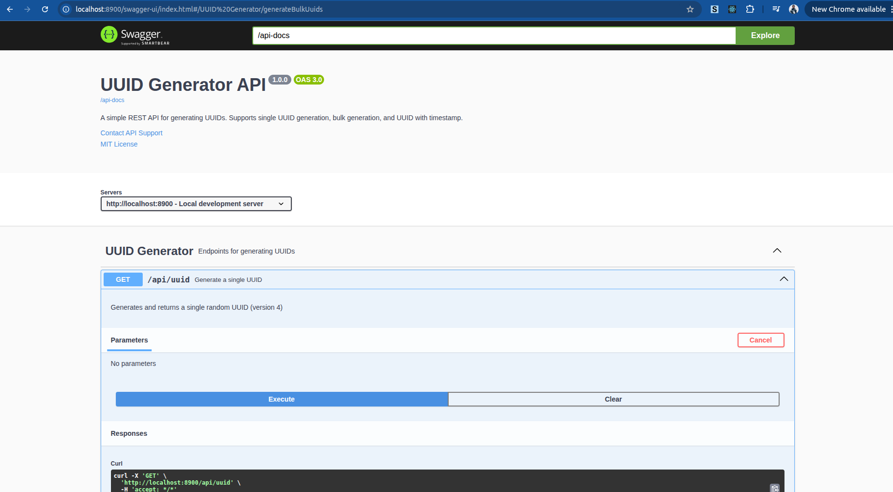
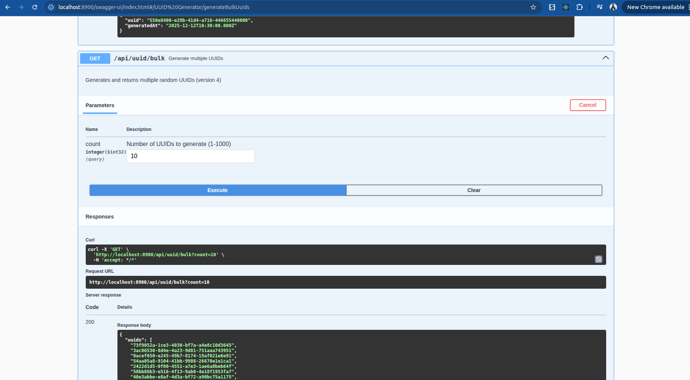

# UUID Generator API

A simple Spring Boot REST API service that generates UUIDs with Swagger UI documentation.

## Features

- Generate single UUID
- Generate multiple UUIDs (bulk generation)
- Generate UUID with timestamp
- Swagger UI documentation
- CORS configuration
- Global exception handling

## Tech Stack

- **Java 21**
- **Spring Boot 3.2.1**
- **Spring Web**
- **Springdoc OpenAPI** (Swagger UI)
- **Maven**

## Getting Started

### Prerequisites

- Java 21 or higher
- Maven 3.6+

### Build the Project

```bash
mvn clean package
```

### Run the Application

**Using Maven:**
```bash
mvn spring-boot:run
```

**Using JAR:**
```bash
java -jar target/uuid-generator-1.0.0.jar
```

The application will start on **port 8900**.

### Docker Support

The project includes a multi-stage Dockerfile optimized for size (under 100MB) using Alpine Linux and a custom JRE.

**Build the Image:**
```bash
docker build -t uuid-generator:minimal .
```

**Run the Container:**
```bash
docker run -d -p 8900:8900 --name uuid-app uuid-generator:minimal
```

## API Endpoints

| Method | Endpoint | Description |
|--------|----------|-------------|
| GET | `/api/uuid` | Generate a single UUID |
| GET | `/api/uuid/bulk?count=10` | Generate multiple UUIDs (1-1000) |
| GET | `/api/uuid/timestamp` | Generate UUID with timestamp |

### Example Responses

**Single UUID:**



```json
{
  "uuid": "550e8400-e29b-41d4-a716-446655440000"
}
```

**Bulk UUIDs:**



```json
{
  "uuids": [
    "550e8400-e29b-41d4-a716-446655440000",
    "6ba7b810-9dad-11d1-80b4-00c04fd430c8"
  ],
  "count": 2
}
```

**UUID with Timestamp:**
```json
{
  "uuid": "550e8400-e29b-41d4-a716-446655440000",
  "generatedAt": "2025-12-12T10:30:00.000Z"
}
```

## Swagger UI

Access the interactive API documentation at:

- **Swagger UI:** [http://localhost:8900/swagger-ui.html](http://localhost:8900/swagger-ui.html)
- **OpenAPI JSON:** [http://localhost:8900/api-docs](http://localhost:8900/api-docs)

## Testing

**Run Tests:**
```bash
mvn test
```

**Test with cURL:**
```bash
# Single UUID
curl http://localhost:8900/api/uuid

# Bulk UUIDs
curl "http://localhost:8900/api/uuid/bulk?count=5"

# UUID with timestamp
curl http://localhost:8900/api/uuid/timestamp
```


## Configuration

Configuration is managed in `application.properties`:

| Property | Default | Description |
|----------|---------|-------------|
| `server.port` | 8900 | Server port |
| `springdoc.swagger-ui.path` | /swagger-ui.html | Swagger UI path |

## License

[ Apache License](LICENSE)

